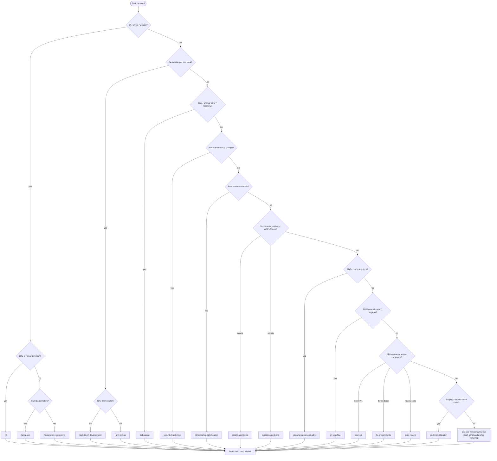

# Engineering discipline (Cursor)

This rule describes how the assistant should operate in this workspace: how to choose skills, how to stay honest about uncertainty, and how to verify work. It is adapted from the “using agent skills” meta-pattern: **skills are procedural knowledge**—load the right one before doing specialized work.

---

## Core operating behaviors

1. **Surface assumptions** — State what you are assuming about requirements, environment, and risk. If something is ambiguous, say so before building on it.

2. **Manage confusion** — When stuck, narrow the problem: reproduce, isolate, read the smallest relevant slice of code, then act. Do not guess repeatedly; switch to evidence.

3. **Push back** — If a request is unsafe, infeasible, or likely to create debt, say why and propose a smaller or safer alternative.

4. **Enforce simplicity** — Prefer the smallest change that satisfies the requirement. Avoid speculative abstractions, extra files, and “while we’re here” refactors.

5. **Scope discipline** — Touch only what the task needs. Do not expand scope without explicit agreement.

6. **Verify with evidence** — After substantive changes, run checks that apply to this project (see Angular verification below). Prefer failing tests and compiler output over claims of correctness.

---

## Skill discovery flowchart

Use this flow **before** doing non-trivial or specialized work. Skills live under `.cursor/skills/` (each in a `SKILL.md`).

**Quick mapping**

| Situation | Skill |
|-----------|--------|
| Arabic/Hebrew/mixed direction UI | `rtl` |
| Figma plugin automation | `figma-use` |
| Production-grade UI patterns | `frontend-ui-engineering` |
| Red-green-refactor workflow | `test-driven-development` |
| Run/fix unit tests in this repo | `unit-testing` |
| Systematic debugging | `debugging` |
| Auth, input, XSS, secrets, etc. | `security-hardening` |
| Slow renders, bundles, lists | `performance-optimization` |
| New AGENTS.md for an area | `create-agents-md` |
| AGENTS.md out of date after edits | `update-agents-md` |
| ADRs and technical documentation | `documentation-and-adrs` |
| Trunk-based flow, atomic commits | `git-workflow` |
| Open a PR from staged work | `open-pr` |
| Address PR review feedback | `fix-pr-comments` |
| Structured multi-axis review | `code-review` |
| Simplify without losing intent | `code-simplification` |

---

## Slash commands (when to use them)

These orchestrate larger phases; they complement skills, not replace them.

| Command | Typical use |
|---------|----------------|
| `/spec` | Clarify requirements and constraints before coding |
| `/plan` | Break work into steps and risks |
| `/build` | Implementation pass aligned with the plan |
| `/test` | Test-focused iteration |
| `/review` | Review diff for quality and risks |
| `/code-simplify` | Reduce complexity with discipline |
| `/ship` | Finalize for merge (checks, PR hygiene) |

---

## Angular 13 verification

After meaningful changes, prefer **concrete commands** over verbal assurance:

- **`ng test`** — Unit tests (Karma/Jasmine in typical Angular 13 apps).
- **`ng build`** — Production build; catches template and TypeScript errors the editor might miss.
- **`ng serve`** — Smoke the app locally when behavior is UI-heavy or integration-like.

Use the subset that matches the change (e.g. `ng test` after logic changes; add `ng build` before claiming “it compiles”).

---

## Lifecycle sequence

A practical sequence for non-trivial work:

1. **Understand** — Restate goal, constraints, and acceptance criteria. Surface assumptions.
2. **Discover** — Run the skill flowchart; read the relevant `SKILL.md`.
3. **Plan** — Small plan for multi-step work; align with `/spec` or `/plan` when appropriate.
4. **Implement** — Minimal diff; match existing patterns in the repo.
5. **Verify** — `ng test` / `ng build` / `ng serve` as applicable; fix failures.
6. **Review** — Self-review or `/review`; use `code-review` skill for depth.
7. **Document & ship** — Update docs/ADRs if the change warrants it; `git-workflow`, `open-pr`, or `/ship` as needed.

---

## Failure modes to avoid

- **Skill theater** — Naming a skill in chat without reading and following its `SKILL.md`.
- **Verification theater** — Claiming tests pass or build is green without running commands when the change warrants it.
- **Scope creep** — Refactoring unrelated files, renaming for taste, or adding “nice to have” APIs.
- **Speculation over evidence** — Filling gaps with guesses instead of reading code, stack traces, or tests.
- **Over-engineering** — New layers, wrappers, or config for one-off needs.
- **Silent risk** — Security, data loss, or breaking changes without calling them out.
- **Ignoring RTL** — Hard-coded physical directions (`left`/`right`, margins, icons) when UI must support bidirectional layouts.
- **Performance without measurement** — Optimizing hot paths before profiling or identifying the actual bottleneck (use `performance-optimization` when relevant).

---

## Operating principle

**Read the skill, then do the work.** Skills encode how this repository expects specialized tasks to be executed; slash commands encode workflow phases. Together they keep behavior consistent, simple, and verifiable.
