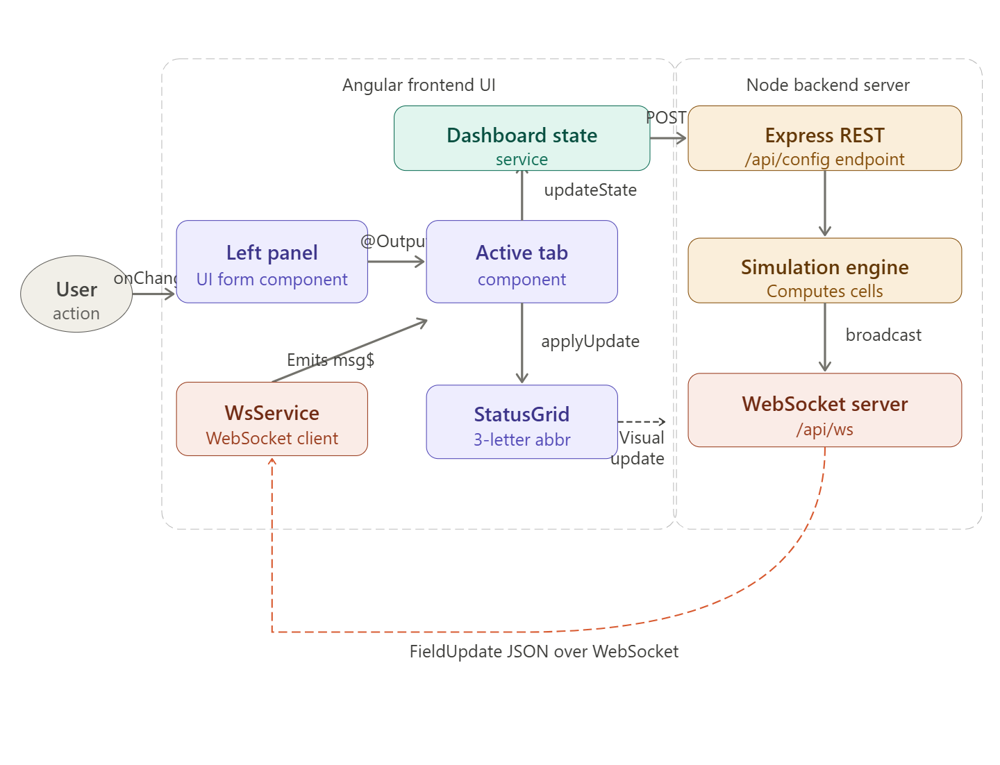
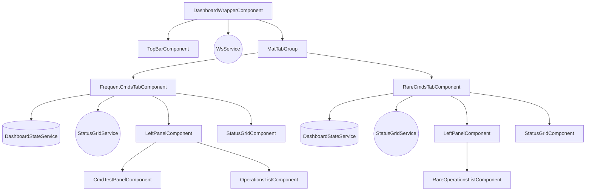

# Architecture: Configuration Dashboard

**Feature**: 1-config-dashboard
**Last Updated**: 2026-04-14 (Post Phase R8 Tab Redesign)

---

## High-Level Architecture Overview

The Configuration Dashboard underwent a major structural refactor (Phase R8) to introduce a tabbed interface. The core orchestrator is now the `DashboardWrapperComponent`, which fully encapsulates the layout logic, WebSocket connectivity, and the Material tab switching.

By splitting the UI into two primary tabs, the workspace ensures that future modules (whether they target "Frequent" commands or "Rare" commands) can safely reuse core atomic components without polluting a single monolithic container.

### Component Dependency Graph



### Data Flow & Payload Lifecycle

This sequence diagram illustrates how configuration actions flow upwards to the backend and how WebSocket signals are broadcasted downwards into the grid interfaces.

```mermaid
flowchart LR
    User([User Action]) -->|onChange / Save| LeftPanel[Left Panel Component\nUI Form]
    
    subgraph Angular Frontend UI
        LeftPanel -->|@Output event| Tab[Active Tab Component]
        Tab -->|updateState / saveConfig| State[(Dashboard State Service)]
        WS[WsService] -->|Emits message$| Tab
        Tab -->|applyUpdate| Grid[StatusGrid Component/Service]
    end
    
    subgraph Node Backend Server
        State -->|POST /api/config| REST(Express REST endpoint)
        REST --> Engine[Simulation Engine]
        Engine -->|Broadcast computed cells| WSS(WebSocket /api/ws)
    end
    
    WSS -.->|FieldUpdate JSON over WS| WS
    Grid -->|Renders 3-letter Abbr| User([Visual Update])
```

---

## Core Refactoring & Decoupling Explained

### 1. The Wrapper Pattern `DashboardWrapperComponent`
Instead of having everything inside `ConfigDashboardComponent` as originally envisioned, the dashboard uses a nested architecture where `DashboardWrapperComponent` provides `WsService` (WebSocket Connections) at the highest level. The wrapper controls the current `scenario$` and feeds that reactive stream down to the individual Tabs.

### 2. Status Grid Isolation (`StatusGridService`)
The grid component is fully self-contained. It no longer relies on hardcoded imports of Domain operations (like `OPERATIONS_FIELDS`). 

**How it works**:
- Each Tab dynamically configures its own `StatusGridService` via `.configure(columns, abbrLookup, rows)`.
- The `WsService` pipes global incoming WebSocket update streams.
- The Tab subscribes to `WsService.message$` and pipes the updates into `StatusGridService.applyUpdate(msg)`. 
- Because `StatusGridService` uses a dynamically provided `AbbrLookup` dictionary, it safely replaces values with 3-letter abbreviations regardless of whether the row belongs to the Frequent tab or the Rare tab.

### 3. State Management
`DashboardStateService` continues to manage the primary state model payload. 
The Left Panel forms (both frequent and rare) dispatch specific slices via `@Output()`, which the individual Tab components capture and funnel into `stateService.saveConfig()`. Wait-loops and rollback actions remain at the local component level ensuring isolation.

### 4. WebSocket Connectivity (`WsService`)
Websocket reconnection logic, timers, and RxJS Subjects are purely extracted into the injected `WsService`. This completely removes IO network constraints from the domain components. 

---

## Implementation Constraints for Future Work
1. **Module Scoping**: When generating new tabs, you must reuse `LeftPanelComponent` and `StatusGridComponent`. 
2. **Global State**: Global scenario data (`isRealtime`, etc.) must exclusively be passed via `@Input()` from the wrapper.
3. **No `$any()` typings**: The UI completely bans casting in `html`. Type safety must use standard TS assertions inside the `.ts` component logic (e.g. `getStringValue()`).
4. **Grid Row Declarations**: You must provide a custom `buildAbbrLookup` dictionary mapped specific to your Tab's domain objects in `ngOnInit()`.
