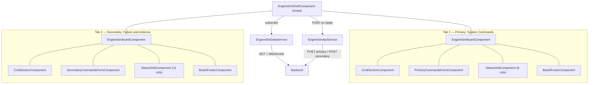
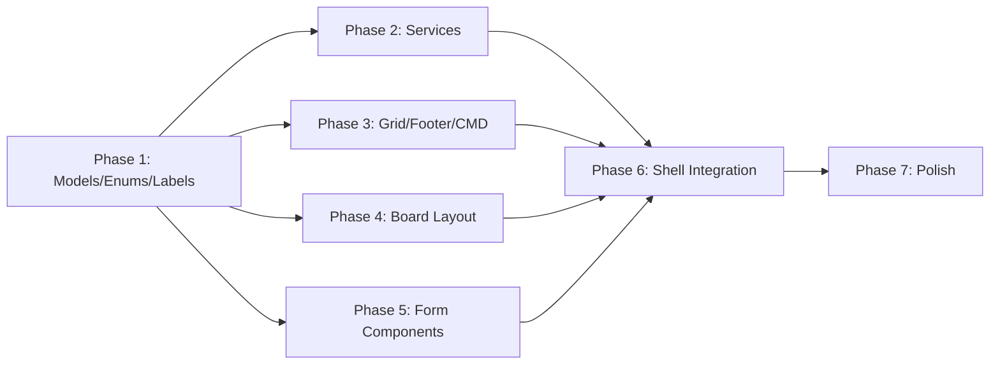

# Engine Simulator Dashboard — Implementation Plan

**Feature**: engine-sim-dashboard
**Spec**: [spec.md](./spec.md)
**Field Definitions**: [field-definitions.md](./field-definitions.md)
**Date**: 2026-04-21
**Status**: Phase 1 ✅ · Phase 2 ✅ · Phases 3-7 pending

---

## 1. Architecture Overview

A single self-contained feature module (`EngineSimModule`) with one smart component (shell) orchestrating six dumb components. Data flows down via `@Input`, events flow up via `@Output`. No NgRx, no third-party libs beyond Material.



### Architecture Decisions

| Decision | Choice | Rationale |
|----------|--------|-----------|
| Form strategy | Reactive Forms | Spec requires programmatic disable, reset, defaults, and snapshot/restore on cancel |
| CMD state | Component properties on shell | Simple draft + saved values — no need for a dedicated service (code-simplification) |
| Grid component | Single reusable `StatusGridComponent` | Receives dynamic column config and row data — no board-specific knowledge |
| Board layout | Content projection via `ng-content` | Board provides sticky header/body/footer shell; each tab projects its specific form |
| Service scope | Feature-scoped (`providers` in module) | Not `providedIn: 'root'` — self-contained for migration |
| API URLs | `InjectionToken` | Migration portability — no hardcoded URLs, no environment file dependency |

---

## 2. Technology Stack

Uses only what's already in the project:

| Layer | Technology | Version |
|-------|------------|---------|
| Framework | Angular | ~13.3 |
| UI Library | Angular Material | ^13.3.9 |
| Language | TypeScript | ~4.6 |
| Reactive | RxJS | ~7.5 |
| Existing components | `AppDropdownModule`, `AppMultiDropdownModule` (with CVA) | — |
| Existing styles | `_dropdowns.scss`, `_variables.scss` | — |
| New Material modules | `MatTabsModule`, `MatSlideToggleModule`, `MatButtonModule` | — |

No new dependencies.

---

## 3. File Structure

All files live under `src/app/features/engine-sim/`:

```
engine-sim/
├── engine-sim.module.ts
├── shared/                                # Cross-board primitives (no UI)
│   ├── engine-sim.api-contract.ts         # Wire format: EngineSimResponse, EntityData, MCommandItem, BoardPostPayload, EngineSimApiConfig
│   ├── engine-sim.models.ts               # Internal view models: CmdSelection, GridColumn, GridRow, FieldConfig
│   ├── engine-sim.labels.ts               # ENGINE_SIM_LABELS centralized translation map
│   ├── engine-sim.tokens.ts               # ENGINE_SIM_API_CONFIG + ENGINE_SIM_WS_FACTORY injection tokens
│   ├── board-ids.ts                       # BOARD_IDS const + BoardId type (namespaces all data-test-id values)
│   ├── column-ids.ts                      # COL_IDS const + GridColId type (single source for grid column ids)
│   ├── option-values.ts                   # Canonical value maps + derived types (YES_NO, ON_OFF, SIDE, WHEEL, …)
│   ├── cmd-options.ts                     # CMD_SIDE_OPTIONS, CMD_WHEEL_OPTIONS (reused by both boards)
│   └── build-defaults.util.ts             # buildDefaultValues() helper
├── boards/                                # One folder per dashboard tab — self-contained
│   ├── primary-commands/                  # Primary — "System Commands" tab (frequently used)
│   │   ├── primary-commands.options.ts    # DropdownOption arrays (with `abbr`)
│   │   ├── primary-commands.fields.ts     # PRIMARY_COMMANDS_*_FIELDS configs + buildPrimaryCommandsDefaults()
│   │   ├── primary-commands.columns.ts    # 8-column grid
│   │   └── primary-commands-form/         # Phase 5 form component (11 main + 3 "Cmd to GS" fields)
│   └── secondary-commands/                # Secondary — "Failure & Antenna" tab (less frequently used)
│       ├── secondary-commands.options.ts
│       ├── secondary-commands.fields.ts   # SECONDARY_COMMANDS_*_FIELDS configs + buildSecondaryCommandsDefaults()
│       ├── secondary-commands.columns.ts  # 11-column grid (reuses Primary's 8)
│       └── secondary-commands-form/       # Phase 5 form component (14 fields)
├── utils/
│   └── grid-data.utils.ts                 # normalizeResponse() + generic buildRows() — single board-agnostic pipeline
├── services/
│   ├── engine-sim-api.service.ts          # POST for each board
│   └── engine-sim-data.service.ts         # GET + WebSocket → Observable<EngineSimResponse>
└── components/                            # Cross-board / shell-level UI
    ├── engine-sim-shell/                  # Smart: tabs, toggle, CMD state, WS subscription
    ├── engine-sim-board/                  # Dumb layout: sticky CMD + scroll body + sticky footer
    ├── cmd-section/                       # Dumb: 2 multi-dropdowns (side, wheel)
    ├── board-footer/                      # Dumb: Defaults, Cancel, Apply buttons
    └── status-grid/                       # Dumb: dynamic grid with row labels, column hover, cell click
```

Each `boards/<board>/` folder is the **migration unit** — self-contained, depends only on `shared/`. Form components live inside their board folder so the whole dashboard moves as one piece.

---

## 4. Data Model

### Wire format (in `engine-sim.api-contract.ts`)

The types below cross the network boundary — they are dictated by the backend. Quarantined from the internal view models so a backend change is a one-file question.

```typescript
type EntityId = 'left' | 'right';

interface EngineSimResponse {
  // Always 2 entities. entities[0] = left side, entities[1] = right side.
  entities: [EntityData, EntityData];
}

interface EntityData {
  entityId: EntityId;

  // 4 items, one per column on this side.
  // Left  entity: mCommands[0..3] → grid cols L1..L4
  // Right entity: mCommands[0..3] → grid cols R1..R4
  mCommands: [MCommandItem, MCommandItem, MCommandItem, MCommandItem];

  // Per-side TLL/TLR data.
  // Left entity → TLL column. Right entity → TLR column.
  aCommands: ACommandsData;

  // GDL column fields — flat on entity per the backend wire format
  // (no `gdl` wrapper). Side-independent — backend duplicates across both
  // entities for symmetry; the grid reads from entities[0] only.
  gdlFail: string; gdlTempFail: string;
  antTransmitPwr: string; antSelectedCmd: string;
  gdlTransmitPwr: string; uuuAntSelect: string;
}

interface MCommandItem {
  standardFields:   PrimaryStandardFields;     // 11 fields — Primary's 8-col grid rows
  additionalFields: SecondaryAdditionalFields; // 3 fields — Secondary's first 8-col rows
}

interface PrimaryStandardFields {
  tff: string; mlmTransmit: string; videoRec: string; videoRecType: string;
  mtrRec: string; speedPwrOnOff: string; forceTtl: string; nuu: string;
  muDump: string; sendMtrTss: string; abort: string;
}

interface SecondaryAdditionalFields {
  whlCriticalFail: string;
  whlWarningFail: string;
  whlFatalFail: string;
}

interface ACommandsData { // 5 fields — Secondary's TLL/TLR rows (per side)
  tlCriticalFail: string; masterTlFail: string; msTlFail: string;
  tlTempFail: string; tlToAgCommFail: string;
}

// GDL field keys — values themselves are flat on EntityData. This union
// just lets grid-data.utils.ts iterate the group without redeclaring keys.
type GdlFieldKey =
  | 'gdlFail' | 'gdlTempFail'
  | 'antTransmitPwr' | 'antSelectedCmd'
  | 'gdlTransmitPwr' | 'uuuAntSelect';
```

**Why named props over `Record<string, …>`:** every grid cell traces back to a field key the UI knows about. Naming the props lets the compiler catch wire-format drift (a typo'd backend field shows up as a TS error in `grid-data.utils.ts`, not as a blank cell discovered in QA). It's the same "types over tests" stance from Phase 1.

### Grid view models (in `engine-sim.models.ts`)

```typescript
interface GridColumn {
  id: string;    // e.g. 'left1', 'right3', 'tll'
  label: string; // e.g. 'L1', 'R3', 'TLL'
}

interface GridRow {
  fieldKey: string;                    // matches form field key
  label: string;                      // from ENGINE_SIM_LABELS
  values: Record<string, string>;     // colId → abbreviation string
}
```

### Per-board configuration pattern

Each board owns its `*.options.ts`, `*.fields.ts`, and `*.columns.ts` under `boards/<board>/`. Option values come from canonical `as const` maps in `shared/option-values.ts` (so the wire format stays consistent across boards), while `abbr` (display abbreviation) and `label` (translation key) are board-local:

```typescript
// shared/option-values.ts
export const TFF = { NotActive: 'not_active', LightActive: 'light_active', Dominate: 'dominate' } as const;
export type Tff = typeof TFF[keyof typeof TFF];

// boards/primary-commands/primary-commands.options.ts
export const TFF_OPTIONS: LabeledOption[] = [
  { value: TFF.NotActive,   label: L.tffNotActive,   abbr: 'NACV' },
  { value: TFF.LightActive, label: L.tffLightActive, abbr: 'LACV' },
  { value: TFF.Dominate,    label: L.tffDominate,    abbr: 'DMN' },
];

// boards/primary-commands/primary-commands.fields.ts
export const PRIMARY_COMMANDS_MAIN_FIELDS: FieldConfig[] = [
  { key: 'tff', label: L.tff, type: 'single', options: TFF_OPTIONS, defaultValue: TFF.NotActive },
  // ...
];
```

`FieldConfig` carries no "appears in grid" metadata. Form-only fields (Primary's "Cmd to GS" sub-section) are kept in their own array (`PRIMARY_COMMANDS_CMD_TO_GS_FIELDS`) and just not passed to the grid row builder. The form renders `*_ALL_FIELDS`; the grid renders the subset with wire data behind it.

### Label map (in `engine-sim.labels.ts`)

Flat `const` object. Every user-visible string — field names, option labels, button text, section headers, grid headers — is keyed here. Templates reference `LABELS.fieldKey`, never a raw string.

---

## 5. Component Design

### `EngineSimShellComponent` (Smart)

**Owns:**
- `testMode: boolean` (toggle)
- `cmdDraft: CmdSelection` (live edits to CMD dropdowns)
- `cmdSaved: CmdSelection` (persisted on Apply)
- `primaryFormGroup` and `secondaryFormGroup` (created here, passed down)
- `primarySnapshot` / `secondarySnapshot` (for Cancel — last saved state)
- `gridData$: Observable<EngineSimResponse>` via `EngineSimDataService`
- `primaryRows` / `secondaryRows` — precomputed from `gridData$` using pure util functions

**Key logic:**
- On Apply (from either tab): merge CMD + form values into payload, call `EngineSimApiService`, snapshot form state on success
- On Cancel: `formGroup.reset(snapshot)`
- On Defaults: `formGroup.reset(DEFAULTS)`
- On tab change: no special action for CMD (it persists). Form state is lost if not applied (per spec — the `FormGroup` is per-tab but lives at shell level, so Angular handles this naturally via the tab component lifecycle)

**Template:** `mat-tab-group` with two `mat-tab`, each containing `<engine-sim-board>`. Test/live toggle is `mat-slide-toggle` above tabs.

### `EngineSimBoardComponent` (Dumb Layout)

**Purpose:** Provides the sticky CMD (top) + scrollable form+grid (middle) + sticky footer (bottom) structure using flexbox.

**Inputs:** `disabled: boolean`

**Template uses `ng-content` with named slots:**
```html
<div class="board">
  <header class="board__cmd"><ng-content select="[boardCmd]"></ng-content></header>
  <div class="board__body">
    <div class="board__form"><ng-content select="[boardForm]"></ng-content></div>
    <div class="board__grid"><ng-content select="[boardGrid]"></ng-content></div>
  </div>
  <footer class="board__footer"><ng-content select="[boardFooter]"></ng-content></footer>
</div>
```

**SCSS:** Flex column, `height: 100%`, `overflow: hidden` on host. Header/footer `flex-shrink: 0`. Body `flex: 1; overflow-y: auto; display: flex` (form left + grid right). Uses `%` widths internally for resize support.

### `CmdSectionComponent` (Dumb)

**Inputs:** `selection: CmdSelection`, `disabled: boolean`
**Outputs:** `selectionChange: EventEmitter<CmdSelection>`

Two `app-multi-dropdown` instances (Side and Wheel) bound via CVA `formControlName` to an internal `FormGroup` that emits on `valueChanges`. Labels from `LABELS.cmdSide` / `LABELS.cmdWheel`.

### `BoardFooterComponent` (Dumb)

**Outputs:** `defaults`, `cancel`, `apply` (all `EventEmitter<void>`)

Three `mat-button` elements. Takes `@Input() boardId: BoardId` and stamps `[attr.data-test-id]="'footer-' + boardId + '-' + action"` on each button (e.g. `footer-primary-apply`). Labels from `LABELS`.

### `PrimaryCommandsFormComponent` (Dumb — Primary)

**Inputs:** `formGroup: FormGroup`, `disabled: boolean`
**No outputs** — parent reads `formGroup.getRawValue()` directly.

Iterates `PRIMARY_COMMANDS_MAIN_FIELDS` config to render 11 dropdowns using `app-dropdown` / `app-multi-dropdown` with `formControlName`. Below the main fields, a bordered "Cmd to GS" section with 3 more dropdowns (`PRIMARY_COMMANDS_CMD_TO_GS_FIELDS`). Each dropdown gets `[attr.data-test-id]="'form-' + BOARD_IDS.primary + '-' + field.key"` (Secondary form uses `BOARD_IDS.secondary` — the board id is hard-coded per form, not threaded through as an input, since each form component owns exactly one board).

When `disabled` changes: `formGroup.disable()` / `formGroup.enable()`.

### `SecondaryCommandsFormComponent` (Dumb — Secondary)

Same pattern, 14 fields from `SECONDARY_COMMANDS_ALL_FIELDS` (composed of `SECONDARY_COMMANDS_8COL_FIELDS` + `SECONDARY_COMMANDS_TLL_TLR_FIELDS` + `SECONDARY_COMMANDS_GDL_FIELDS`). No sub-sections. All fields render as grid rows.

### `StatusGridComponent` (Dumb)

**Inputs:**
- `columns: GridColumn[]` (8 or 11)
- `rows: GridRow[]`
- `fieldKeys: string[]` (ordered list of field keys this board shows)

**Template:** CSS Grid with `[style.grid-template-columns]="gridTemplateColumns"` precomputed in `ngOnChanges`. First column is row labels, rest are data cells.

**Behavior:**
- Column hover: CSS column class toggled via `mouseenter`/`mouseleave` on cells (stores `hoveredColId`)
- Cell click: stores `selectedCellId` (fieldKey + colId composite)
- Abbreviations: `row.values[col.id]` directly renders the abbr string
- Test IDs: `[attr.data-test-id]="'grid-' + boardId + '-' + row.fieldKey + '-' + col.id"` on each cell, plus `grid-header-{boardId}-{colId}` on column headers and `grid-label-{boardId}-{fieldKey}` on row labels. `boardId: BoardId` is an `@Input` on `StatusGridComponent`.

**SCSS:** White background, `1px solid` borders on cells, highlight class for hovered column, selected cell border. `text-overflow: ellipsis` on cells.

---

## 6. Services

### `EngineSimDataService`

```typescript
connect(): Observable<EngineSimResponse>
```

- Calls GET once on subscribe (seed data)
- Opens WebSocket and merges live updates via `merge(get$, ws$)`
- WebSocket wrapped in Observable with `share()` and `retry({ delay: 3000 })` for reconnect
- Single connection shared across both tabs (called once in shell `ngOnInit`)

### `EngineSimApiService`

```typescript
postPrimary(payload: BoardPostPayload): Observable<void>
postSecondary(payload: BoardPostPayload): Observable<void>
```

- Two POST endpoints (URLs from `ENGINE_SIM_API_CONFIG.primaryPostUrl` / `.secondaryPostUrl`), injected via `ENGINE_SIM_API_CONFIG` token for migration portability

---

## 7. Grid Data Transformation (`grid-data.utils.ts`)

Two-step pipeline. Pure functions, no service:

```typescript
function normalizeResponse(response: EngineSimResponse): FlatGrid;
function buildRows(fields: FieldConfig[], grid: FlatGrid, columns: GridColumn[]): GridRow[];
```

- **`normalizeResponse`** is the only place that knows the wire shape. It flattens `entities[*].mCommands[i].standardFields|additionalFields`, `aCommands`, and the flat GDL props into a column-keyed `FlatGrid` (`Partial<Record<GridColId, Record<fieldKey, rawValue>>>`).
- **`buildRows`** is fully generic — same function for both boards. For each `(field, column)` pair, looks up the raw value in the grid and renders its abbreviation. Caller controls which fields appear: pass `PRIMARY_COMMANDS_MAIN_FIELDS` (excludes "Cmd to GS") for the Primary grid; pass `SECONDARY_COMMANDS_ALL_FIELDS` for Secondary.

Cell rendering rule (`abbrFor`): missing/empty → `''`; known value → its `abbr`; unknown but present → first 3 chars of the raw value (so QA can spot wire drift instead of staring at silent empty cells).

Called in `EngineSimShellComponent` whenever `gridData$` emits — once per frame, then both boards' rows derived from the same `FlatGrid`.

---

## 8. State Management Summary

| State | Where | Mechanism |
|-------|-------|-----------|
| CMD draft | `EngineSimShellComponent.cmdDraft` | Local property, updated on `CmdSectionComponent` output |
| CMD saved | `EngineSimShellComponent.cmdSaved` | Updated on Apply |
| Form state (Primary) | `FormGroup` created in shell | Passed to `PrimaryCommandsFormComponent` |
| Form state (Secondary) | `FormGroup` created in shell | Passed to `SecondaryCommandsFormComponent` |
| Form snapshots | Plain objects | For Cancel restore |
| Test/Live mode | Shell boolean | Passed as `disabled` input |
| Grid data | `async` pipe on `gridData$` | From `EngineSimDataService` |
| Grid rows | Precomputed in shell | From `gridData$` emissions |

No shared services for state. No BehaviorSubjects. All state is component-local in the shell.

---

## 9. Styling Strategy

- Reuse existing `_dropdowns.scss` global overrides (same dropdown look)
- Add new `_engine-sim.scss` partial for dashboard-specific styles (imported in `styles.scss`)
- Grid uses CSS Grid (not `<table>`) with dynamic `grid-template-columns`
- Sticky layout via flexbox (matching the angular-engineering skill pattern)
- Container: parent provides `1150px x 550px`; internals use `%` and `fr` for resize
- Column hover: JS-driven class toggle (CSS `:has()` not reliable in Angular 13 target browsers)
- Theme tokens from `_variables.scss` for spacing
- No `::ng-deep`, no `!important`

---

## 10. Implementation Phases

### Testing Approach (applies to every phase)

Test-after, not strict TDD — the spec is stable enough that tests document what's built rather than drive design. But each phase ships with tests in the same change-set; no phase is "done" until its tests are green.

**Types over tests** — push invariants into the type system whenever possible, then skip the corresponding runtime test. A test for static configuration is a smell; the right tool is a tighter type. Examples already shipped in Phase 1: `FieldConfig` is a discriminated union on `type` (so single fields can't have an array default and vice versa), and `LabeledOption` requires `abbr` (so a board option can't render a blank grid cell).

**What we test** — pure functions, observable contracts, dumb-component input/output behavior, and one happy-path integration spec for the shell.

**What we don't test** — Angular Material internals, CSS layout (visual QA covers that), private methods, snapshot tests of templates, **the shape of static configuration arrays** (the types do that).

**Test file convention** — `<file>.spec.ts` colocated next to source. Jasmine + Karma + ChromeHeadless (existing setup).

### Phase 1: Models, Labels, Per-Board Configuration (XS-S) — ✅ Complete

Foundation layer — no components, no services. Just TypeScript.

- `shared/engine-sim.api-contract.ts` — wire-format types (response, payload, config) with named props per board (`PrimaryStandardFields`, `SecondaryAdditionalFields`, `ACommandsData`, `GdlFieldKey`)
- `shared/engine-sim.models.ts` — internal view models (CmdSelection, GridColumn, GridRow, FieldConfig)
- `shared/engine-sim.labels.ts` — centralized translation map
- `shared/engine-sim.tokens.ts` — `ENGINE_SIM_API_CONFIG` injection token
- `shared/option-values.ts` — canonical `as const` value maps + derived literal-union types
- `shared/cmd-options.ts` — `CMD_SIDE_OPTIONS`, `CMD_WHEEL_OPTIONS`
- `shared/build-defaults.util.ts` — `buildDefaultValues()` helper
- `boards/primary-commands/{options,fields,columns}.ts` — Primary's 14 fields (11 main + 3 "Cmd to GS")
- `boards/secondary-commands/{options,fields,columns}.ts` — Secondary's 14 fields (3 `additionalFields` + 5 `aCommands` + 6 `gdl`)
- `engine-sim.module.ts` — empty shell module

**Acceptance criteria:** `ng build` passes. All types/configs importable.

**Tests delivered (6 specs, all green):**
- `shared/build-defaults.util.spec.ts` — pure utility: array cloning, fresh-object-per-call, mixed single/multi defaults

**Invariants enforced by types (no runtime test needed):**
- `FieldConfig = SingleSelectField | MultiSelectField` — narrowing on the `type` literal forces `defaultValue: string` on single fields and `defaultValue: string[]` on multi fields. A wrong-shape default fails compile.
- `LabeledOption = DropdownOption & { abbr: string }` — every option array used by a field is typed as `LabeledOption[]`, so a missing `abbr` (which would render a blank grid cell) fails compile.
- `GridColId` (in `shared/column-ids.ts`) — every grid column id is a member of one literal-union derived from `COL_IDS`. Typos in column references fail compile.
- Option `value`s come from canonical `as const` maps in `option-values.ts`, exported as derived literal-union types — drift between boards fails compile.

### Phase 2: Services (S) — ✅ Complete

- `shared/column-ids.ts` — `COL_IDS` const + `GridColId` literal-union (single source for column ids)
- `utils/grid-data.utils.ts` — two-step pipeline: `normalizeResponse` (wire-aware) + generic `buildRows` (board-agnostic)
- `services/engine-sim-api.service.ts` — `postPrimary` / `postSecondary`
- `services/engine-sim-data.service.ts` — `connect()`: GET seed → WS stream, auto-reconnect, multicast
- `shared/engine-sim.tokens.ts` — added `ENGINE_SIM_WS_FACTORY` token + `EngineSimWebSocketFactory` type so tests can swap in a fake socket
- `engine-sim.module.ts` — provides both services + the default `webSocket()`-backed factory; imports `HttpClientModule`

**Acceptance criteria:** Services injectable. `normalizeResponse` + `buildRows` produce correct `GridRow[]` from mock response data. `ng test` passes (49/49 green).

**Tests delivered (18 specs, all green):**
- `utils/grid-data.utils.spec.ts` (11)
  - `normalizeResponse` (5): routes `left.mCommands[i]` (standard + additional merged) → `left{i+1}`; same for right; `left.aCommands` → `tll`, `right.aCommands` → `tlr`; left entity flat GDL props → `gdl` (right entity duplicate ignored); `entityId` / `mCommands` / `aCommands` never leak into the gdl cell.
  - `buildRows` (6): emits one row per field in given order; per-field abbreviation lookup per column; missing wire values render empty; **unknown values fall back to first 3 chars of the raw value** (so wire drift is visible to QA, not silently swallowed); only writes to columns it is given (Primary 8 vs Secondary 11); fields not passed in are absent from the rows (form-only fields are filtered by *not* passing them, no metadata flag).
- `services/engine-sim-api.service.spec.ts` (3) — `postPrimary` / `postSecondary` POST to the URLs from the injected `ENGINE_SIM_API_CONFIG` token with the exact `BoardPostPayload` body; no network call until subscribe.
- `services/engine-sim-data.service.spec.ts` (4) — emits GET seed first, then merges WS frames; opens the WS once per stream against `wsUrl`; reconnects after WS error with a 3 s delay (verified via `fakeAsync` + `tick`); multiple subscribers share one upstream connection.

**Design notes:**
- `EngineSimDataService` uses `concat(get$, ws$)` (not `merge`) so a stale WS frame never beats the GET seed onto the screen; `defer` + `retry({ delay })` makes the WS factory re-invoke on every reconnect; `shareReplay({ bufferSize: 1, refCount: true })` keeps the connection single while letting late subscribers see the latest frame.
- The 3 s reconnect delay is a private static constant; if it ever needs to be configurable, lift it to `EngineSimApiConfig`.
- **Grid pipeline split**: `normalizeResponse` is the only place that knows the wire shape. `buildRows` is fully generic — same function for both boards, no per-board variants, no `gridColGroup` routing flag on `FieldConfig`. To exclude a field from the grid (e.g. Primary's "Cmd to GS"), the shell just doesn't pass it to `buildRows`. This shrank the utility from ~120 LoC of board-specific helpers to ~70 LoC of one wire mapper + one row builder, and removed `GridColGroup` from the type system.
- `abbrFor` falls back to `value.slice(0, 3)` when the wire value isn't a known option — surfaces backend drift in the UI instead of rendering blank cells QA can't distinguish from "no data".
- `column-ids.ts` is the single source for column ids — both `*.columns.ts` files and `normalizeResponse` import from it, so renaming a column id is a one-line change.
- `ENGINE_SIM_API_CONFIG` is intentionally NOT provided by `EngineSimModule` — the host project supplies its own URLs at module-setup time, keeping the feature URL-agnostic for migration.

### Phase 3: Dumb Components — Grid + Footer + CMD (S-M) — ✅ Complete

Build the three reusable dumb components that have no board-specific knowledge:

- `StatusGridComponent` — dynamic columns, row labels, column hover, cell click, test IDs
- `BoardFooterComponent` — 3 buttons with outputs and test IDs
- `CmdSectionComponent` — 2 multi-dropdowns with shared selection model

All three are OnPush, declared and exported by `EngineSimModule`, and live under `features/engine-sim/components/<name>/`.

**Acceptance criteria:** Each component renders in isolation with mock inputs. Test IDs present. Column hover works. `ng test` passes.

**Tests delivered (18 specs, all green):**
- `board-footer.component.spec.ts` (5 specs) — three namespaced buttons render; centralized labels; per-button output emission; `disabled` flag disables all buttons; boardId namespacing produces unique secondary ids
- `cmd-section.component.spec.ts` (6 specs) — Side and Wheel dropdowns rendered with stable test ids; `selection` seeds initial value; `selectionChange` merges new sides with existing wheels and vice versa; `disabled` propagates to both dropdowns
- `status-grid.component.spec.ts` (7 specs) — `gridTemplateColumns` precomputed in `ngOnInit` as `minmax(var(--grid-label-col-min), max-content) repeat(N, minmax(var(--grid-data-col-min), 1fr))`; column headers, row labels, and cells get namespaced ids; cell text equals `row.values[col.id]`; `mouseenter`/`mouseleave` toggle `hoveredColId`; cell click sets `selectedCellId="{fieldKey}|{colId}"`; boardId namespacing carries through every test-id prefix

**Notes from Phase 3 implementation:**
- All three component specs use a host wrapper component (not direct property mutation). Setting `@Input()`s straight on the OnPush child does not dirty its view and does not propagate down through bindings — `[disabled]` would not flow to children, and any `ngOnChanges`-derived view state would never recompute. The wrapper makes inputs flow through Angular's binding system, matching how the shell will wire them in Phases 5–6.
- `StatusGridComponent` writes `gridTemplateColumns` from `ngOnInit` (not a getter, not `ngOnChanges`) — `columns` is a set-once input per board, and a getter would recompute on every change-detection tick. The doc comment flags `ngOnChanges` as the escape hatch if `columns` ever becomes reactive (e.g. dynamic column toggles).
- `[style.grid-template-columns]` requires the kebab-case binding name; the component property stays `gridTemplateColumns` (camelCase) per Angular's style binding convention.
- No `markForCheck()` anywhere — `(click)` and `(mouseenter)`/`(mouseleave)` already trigger CD for OnPush components since they fire inside the Angular zone.

**Follow-up cleanup (post-Phase 3 review):**
- Centralized colors and layout-impacting sizing into `src/app/features/engine-sim/styles/_engine-sim-tokens.scss`. All three component SCSS files import it via `@import 'engine-sim-tokens';` — the flat path is resolved through `stylePreprocessorOptions.includePaths` in `angular.json` (added to both `build` and `test` targets). When migrating the feature, the host project's `angular.json` needs the same `includePaths` entry pointing at `src/app/features/engine-sim/styles`.
- Sizing tokens are tuned for the 1150×550 shell envelope: `$grid-label-col-min: 90px`, `$grid-data-col-min: 44px` (down from 120/56). Math: 11 cols × 44 + 90 = 574px, fits a ~640px right pane without horizontal scroll. Retune in `_engine-sim-tokens.scss` if the host gives us a different envelope.
- `StatusGridComponent` re-exports the SCSS sizing tokens as CSS custom properties on `:host` (`--grid-label-col-min`, `--grid-data-col-min`). The TS-built `gridTemplateColumns` string references them via `var(--…)` so SCSS stays the single source of truth — changing the sizing budget is a one-line edit in the tokens partial, no TS change required. **Caveat:** if a future edit moves the `--grid-…` declarations off `:host`, the TS template silently falls back to CSS Grid defaults. A pixel-width regression test would catch this; deferred until needed.
- `readonly` audit applied: `@Output()` emitters, injected services (`private readonly`), instance constants (`labels`, options), and `trackBy` arrow functions are all `readonly`. `@Input()` properties intentionally are **not** marked readonly — Angular rebinds them, so the modifier would mislead. Mutable view state (`hoveredColId`, `selectedCellId`, `gridTemplateColumns`) is not readonly because it's reassigned at runtime.

### Phase 4: Board Layout Component (S) — ✅ Complete

- `EngineSimBoardComponent` — sticky header/footer layout with `ng-content` slots
- SCSS for the two-column (form + grid) split, sticky behavior, scroll

**Acceptance criteria:** Content projection works. Sticky header/footer verified. Resize shrinks proportionally.

**Tests delivered (6 specs, all green):**
- `engine-sim-board.component.spec.ts` — four structural slot containers render (`__cmd`, `__form`, `__grid`, `__footer`); each marker (`[boardCmd]`, `[boardForm]`, `[boardGrid]`, `[boardFooter]`) projects into the matching container; form + grid live inside the scrollable body container while cmd + footer do not (containment assertion — couples the spec to the layout contract, not specific CSS values)

**Notes from Phase 4 implementation:**
- Zero inputs, zero outputs, zero logic. The board is pure layout: 4 `ng-content` slots wrapped in flex/grid containers. The shell wires data and events directly to the projected children — `[disabled]` flows from shell to `<primary-commands-form [disabled]="…" boardForm>`, not through the board. Spec table mention of "Receives `disabled` from test/live mode" describes data flow, not a literal `@Input` on the board.
- "Sticky" behavior is implemented via flex-column layout (cmd + footer = `flex: 0 0 auto`, body = `flex: 1 1 auto` with `overflow` on its grid children) rather than `position: sticky`. Cleaner: no stacking-context games, no scroll-container assumptions, no need for the parent to be the scroll root. The user-visible behavior (cmd row pinned at top, footer pinned at bottom, middle scrolls) is identical.
- Form / grid horizontal split is **4 : 6** — gives the 11-column secondary grid the ~640px pane it needs (90 + 11 × 44 = 574px minimum), leaving ~460px for form rows. Documented as a token at the top of the SCSS so it's tunable in one place.
- `min-height: 0` on the body and `min-width: 0` / `min-height: 0` on form/grid columns are critical — without them, flex/grid children refuse to shrink below their intrinsic content size and the layout overflows on narrow shells. Comments in the SCSS explain why each one is needed.
- Slot markers use plain attribute selectors (`[boardCmd]`, `[boardForm]`, `[boardGrid]`, `[boardFooter]`) so consumers can attach them to any element or component without coupling the layout to a specific child class. CamelCase chosen to match the rest of Angular's directive / projection conventions.

### Phase 5: Form Components (M) — ✅ Complete

- `PrimaryCommandsFormComponent` (under `boards/primary-commands/primary-commands-form/`) — 11 main fields + 3 "Cmd to GS" fields, all from config arrays
- `SecondaryCommandsFormComponent` (under `boards/secondary-commands/secondary-commands-form/`) — 14 fields

Both consume `FormGroup` + `disabled` as inputs. All dropdowns use `formControlName` (CVA via `AppDropdownCvaDirective`).

**Acceptance criteria:** Forms render all fields with correct options and defaults. Disable/enable toggles all controls. Test IDs on every dropdown. `ng test` passes.

**Tests delivered (12 specs total, all green):**
- `primary-commands-form.component.spec.ts` (6 specs) — one dropdown per field in `PRIMARY_COMMANDS_ALL_FIELDS` (with total-count sanity); "Cmd to GS" sub-section header + its three fields render; multi vs single fields render via the right dropdown component (`app-multi-dropdown` vs `app-dropdown`); FormGroup seeded to per-field defaults; `[disabled]=true` disables the whole FormGroup and every control; flipping back re-enables it
- `secondary-commands-form.component.spec.ts` (6 specs) — same shape for `SECONDARY_COMMANDS_ALL_FIELDS`, plus an explicit "no sub-section header" assertion since the secondary form is intentionally flat

**Notes from Phase 5 implementation:**
- **`buildFormGroup(fields)` util added in `shared/build-form-group.util.ts`** — takes a `FieldConfig[]` and returns a `FormGroup` with one `FormControl` per field, seeded to the field's `defaultValue`. Used by both form specs and (in Phase 6) the shell when it constructs each board's reactive form. Keeping the helper in one place means the wire-up is identical in tests and production — the shell can never build a different shape than the form expects to render.
- **Row markup is inlined in both ngFor blocks** (Primary's main + cmd-to-gs sections) rather than extracted to an `<ng-template>` rendered via `*ngTemplateOutlet`. Reason: embedded views created via `*ngTemplateOutlet` don't inherit the parent `formGroup` directive's DI scope, so `formControlName` falls back to "no parent formGroup" and throws at runtime. The duplication is small (~20 lines) and the simplicity is worth more than the DRY win.
- **Section header test ids use a different prefix (`section-{boardId}-{name}`) from field test ids (`form-{boardId}-{fieldKey}`)** so a `[data-test-id^="form-{boardId}-"]` selector counts only field dropdowns. Originally tried `form-primary-cmd-to-gs-header` and the count assertion silently included it — caught by the spec on the first red, fixed by renaming.
- **Form components own enable/disable on the FormGroup** via `ngOnChanges` watching either `disabled` or `formGroup` input changes. Uses `{ emitEvent: false }` because toggling test/live mode is a UI concern, not a value change — downstream `valueChanges` subscribers should not see a phantom event when the user flips the mode toggle.
- **Each row uses CSS Grid (`label-col + minmax(0, 1fr) control-col`)** so the control side can shrink with the form pane on narrow shells. `min-width: 0` on the control wrapper is the must-have — without it, `mat-form-field`'s intrinsic width pushes past the pane and breaks the layout.
- **Primary's "Cmd to GS" sub-header** uses a boxed pill style that mirrors the cmd-section title — both are bordered with `currentColor` + `$control-radius` from the shared tokens partial, so they read as one visual family.
- **`disabled` input intentionally lives on the form component, not on the board layout.** The shell wires the `[disabled]` directly: `<engine-sim-primary-commands-form [disabled]="!testMode" boardForm>`. The board (Phase 4) is pure layout and doesn't pass anything through.
- **Demo page wired with both standalone form previews + a real Primary form inside the full board layout** (replacing the Phase 4 form stub). Each standalone preview has a "Toggle disabled" button so the test/live mode behavior is observable end-to-end.

### Phase 6: Shell Component — Integration (M-L)

- `EngineSimShellComponent` — the smart orchestrator
- Wire everything: tabs, toggle, CMD state, form creation, Apply/Cancel/Defaults, grid data subscription, data transformation
- `EngineSimModule` final wiring — declare all components, import dependencies

**Acceptance criteria:** Full feature works end-to-end. Tab switching preserves CMD. Apply saves, Cancel reverts, Defaults resets. Grid shows live data. Test/Live toggle disables forms. `ng build` clean. `ng test` passes.

**Tests:**
- `engine-sim-shell.component.spec.ts` — Apply on Primary tab calls `EngineSimApiService.postPrimary` with `{ sides, wheels, fields: { ...defaults, ...edits } }`; Cancel restores the form to the snapshot; Defaults resets to `buildPrimaryCommandsDefaults()`; switching tabs preserves `cmdSaved` but not unapplied form edits; toggling test mode off disables both form groups but leaves the grid enabled (use spy services injected via TestBed providers)

### Phase 7: Polish and Verify (S)

- Visual QA — layout, spacing, alignment, sticky behavior
- Resize testing — shrink container, verify proportional behavior
- All `data-test-id` attributes verified
- Full test suite green
- Production build clean

**Tests:** No new tests — this phase is verification only. Confirm `ng test --no-watch --browsers=ChromeHeadless` and `ng build` are both clean.

---

## 11. Parallelism Map



After Phase 1, Phases 2-5 are independent and can run in parallel. Phase 6 depends on all of them. Phase 7 depends on Phase 6.

---

## 12. Risk Assessment

| Risk | Impact | Likelihood | Mitigation |
|------|--------|------------|------------|
| WebSocket reconnect causes stale data | Medium | Medium | On reconnect, re-fetch via GET to seed fresh data before resuming the WS stream |
| Angular Material tabs destroy content on switch | Medium | Low | Keep `FormGroup` instances at shell level so they survive tab switches regardless |
| Grid row alignment with form rows | Medium | Medium | Use same `FieldConfig[]` array for both form and grid ordering; matching fixed row heights |
| 11-column grid overflow on small containers | Low | Medium | `minmax(0, 1fr)` columns + `text-overflow: ellipsis` + small font on grid cells |
| Secondary dual grid mappings (L1-R4 vs TLL/TLR/GDL) | Medium | Low | `buildSecondaryRows` util explicitly sets only mapped columns; grid renders empty string for missing keys |

---

## 13. Open Questions (from Spec)

- **Any fields scrolled out of view?** — The screenshots may not show all fields. Confirm the field lists in `field-definitions.md` are complete before Phase 5.
- **WebSocket URL / GET endpoints** — Not specified. Will use injection token with placeholder URLs.
- **Primary `videoRecType` (multi-select) wire shape** — Form value is `string[]`, but each grid cell shows a single abbreviation. Wire is currently typed as `string` (one display value per cell). Confirm whether the backend sends the full multi-select array or a single representative value before Phase 2's `grid-data.utils.ts` lands.
- **Primary `videoRecType` default `['no']`** — Currently pre-selects "No". Confirm whether this should be `[]` (no pre-selection) for a multi-select.
- ~~**Secondary `aCommands` / GDL shape**~~ — Resolved. `aCommands` carries 5 named props per side (TLL on left, TLR on right). The 6 GDL fields are flat on `EntityData` (no wrapper), duplicated across both entities — read from `entities[0]`.

---

## Next Steps

1. Review this plan
2. Start implementation with Phase 1 (Models, Enums, Labels)
3. After Phase 1, Phases 2-5 can run in parallel

---

## 14. Phase 5 Polish — Follow-up Notes (post-build)

These adjustments landed after the initial Phase 5 build, in response to demo-page visual review and a design discussion about `[disabled]` ergonomics. Captured here so Phase 6 starts from the corrected baseline.

### 14.1 Dropdown width — `.dropdown-stretch` opt-in utility

**Where**: `src/styles/_dropdowns.scss` — appended a single utility class:

```scss
.dropdown-stretch {
  .app-dropdown-wrapper { justify-content: stretch; }
  .app-dropdown-field.mat-form-field-appearance-fill { width: 100%; }
}
```

**Opt-in**: Both form root elements got `class="… dropdown-stretch"`. The class is generic — any future container that needs the same behavior just adds it; no domain-specific selectors hardcoded into the global stylesheet.

**Why global, not in each form's SCSS**: Material's `mat-form-field` internals sit behind the dropdown component's encapsulation. Reaching them from a component would need `::ng-deep` (project policy: avoid). The global file already owns every other `mat-form-field` override, so the new rule sits next to its peers and migrates with them.

**Effect**: Inside any `.dropdown-stretch` container, every dropdown fills its column → all dropdowns read the same width regardless of selected text length. Outside (CMD section, demo standalone previews, future consumers without the class), the dropdown keeps its default shrink-to-content behavior.

### 14.2 Board layout — CMD inside the left pane

**Where**: `src/app/features/engine-sim/components/engine-sim-board/engine-sim-board.component.{html,scss,spec.ts}`.

**Before**: CMD was a top row spanning the full board width (CMD → body → footer, vertical stack).

**After**: CMD sits inside a new `__left` pane stacked above the form. The `__body` is now `[__left | __grid]` side-by-side; the grid takes the full body height with no empty space above it.

**Why**: The user's visual feedback on the demo was that CMD, form, and footer should visually share a width. Putting CMD inside the left pane makes that "share a width" a structural property of the layout rather than a tuning game with margins.

```text
+------------------+----------------+
| CMD              |                |
| ---------------- |                |
| form (scrolls)   |   grid (4:6)   |
+------------------+----------------+
| footer (full width)               |
+-----------------------------------+
```

The footer stays a sibling of `__body` (full-width action bar); CMD sits alongside the form so they line up edge-to-edge. Spec assertions updated to lock both invariants: cmd+form+grid all live inside `__body`, footer does not; cmd+form share the `__left` container, grid does not.

### 14.3 Demo board preview — real envelope (1150 × 550)

**Where**: `src/app/demo/demo-page.component.scss`.

**Change**: The full-board demo now renders at the production envelope (`width: 1150px; height: 550px`). The narrow demo viewport (`max-width: 880px`) used to crush the layout, hiding bugs and making the form/grid pane look wrong. The parent `.demo-section` now allows `overflow-x: auto` so the section card scrolls horizontally on narrow demo viewports instead of clipping.

**Why this matters past the demo**: The grid is sized for ~640px (11 cols × 44 + 90 label = 574 minimum). At ~440px (the squashed demo), the grid was the dominant pressure on layout decisions. Sizing the demo to the real shell envelope means review feedback now applies to the actual production geometry.

### 14.4 Dropping the form components' `[disabled]` input

**Where**: `boards/primary-commands/primary-commands-form/primary-commands-form.component.ts`, `boards/secondary-commands/secondary-commands-form/secondary-commands-form.component.ts`, both `.spec.ts` files, plus the demo page.

**Before**:
```typescript
@Input() formGroup!: FormGroup;
@Input() disabled = false;

ngOnChanges(changes: SimpleChanges): void {
  if (changes['disabled'] || changes['formGroup']) {
    this.disabled
      ? this.formGroup.disable({ emitEvent: false })
      : this.formGroup.enable({ emitEvent: false });
  }
}
```

**After**:
```typescript
@Input() formGroup!: FormGroup;
```

**Why**: Two sources of truth for "is this form disabled?" (the boolean input and the `FormGroup`'s own state) is one too many. The shell already owns the `FormGroup`; making it own the disabled bit too keeps a single source of truth and removes a whole `ngOnChanges` lifecycle hook from each form component.

**Phase 6 contract**: The shell holds the test-mode toggle. When test mode flips, the shell calls `primaryFormGroup.disable()` / `.enable()` (and similarly for secondary). The form components are pure renderers — they read the FormGroup, project it through `formControlName`, and Angular's `FormGroup.statusChanges` propagates the disabled state down to every control automatically.

**Spec rewrites**: Both `*-form.component.spec.ts` files dropped the host wrapper's `disabled` field and replaced the two `[disabled]` input tests with two `formGroup.disable() / .enable()` tests that exercise the actual production contract. Net change: same coverage, fewer lines, no test for a layer that no longer exists.

**Demo update**: The demo's "Toggle disabled" buttons now call `togglePrimaryFormDisabled()` / `toggleSecondaryFormDisabled()` which hit `formGroup.disable()` / `.enable()` directly. The labels read `formGroup.disabled` instead of a local boolean. The full-board demo's projected primary form likewise drops the `[disabled]` attribute binding.
