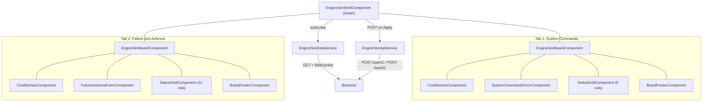
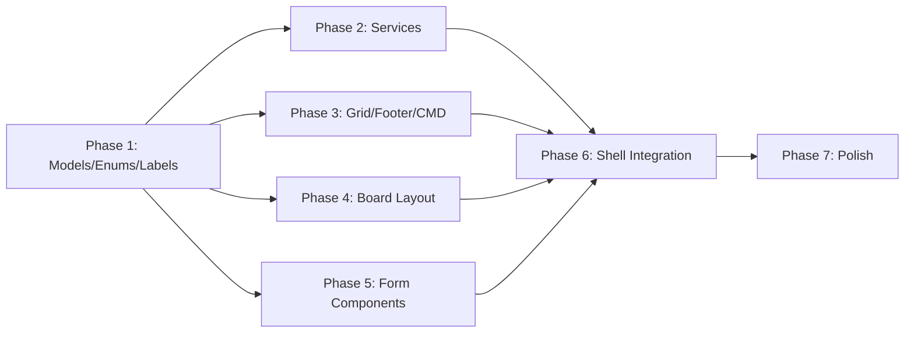

# Engine Simulator Dashboard — Implementation Plan

**Feature**: engine-sim-dashboard
**Spec**: [spec.md](./spec.md)
**Field Definitions**: [field-definitions.md](./field-definitions.md)
**Date**: 2026-04-21
**Status**: Ready for Implementation

---

## 1. Architecture Overview

A single self-contained feature module (`EngineSimModule`) with one smart component (shell) orchestrating six dumb components. Data flows down via `@Input`, events flow up via `@Output`. No NgRx, no third-party libs beyond Material.



### Architecture Decisions

| Decision | Choice | Rationale |
|----------|--------|-----------|
| Form strategy | Reactive Forms | Spec requires programmatic disable, reset, defaults, and snapshot/restore on cancel |
| CMD state | Component properties on shell | Simple draft + saved values — no need for a dedicated service (code-simplification) |
| Grid component | Single reusable `StatusGridComponent` | Receives dynamic column config and row data — no board-specific knowledge |
| Board layout | Content projection via `ng-content` | Board provides sticky header/body/footer shell; each tab projects its specific form |
| Service scope | Feature-scoped (`providers` in module) | Not `providedIn: 'root'` — self-contained for migration |
| API URLs | `InjectionToken` | Migration portability — no hardcoded URLs, no environment file dependency |

---

## 2. Technology Stack

Uses only what's already in the project:

| Layer | Technology | Version |
|-------|------------|---------|
| Framework | Angular | ~13.3 |
| UI Library | Angular Material | ^13.3.9 |
| Language | TypeScript | ~4.6 |
| Reactive | RxJS | ~7.5 |
| Existing components | `AppDropdownModule`, `AppMultiDropdownModule` (with CVA) | — |
| Existing styles | `_dropdowns.scss`, `_variables.scss` | — |
| New Material modules | `MatTabsModule`, `MatSlideToggleModule`, `MatButtonModule` | — |

No new dependencies.

---

## 3. File Structure

All files live under `src/app/features/engine-sim/`:

```
engine-sim/
├── engine-sim.module.ts
├── engine-sim.tokens.ts                   # InjectionToken for API config
├── models/
│   ├── engine-sim.models.ts               # Response, EntityData, MCommandItem, CmdSelection, etc.
│   ├── engine-sim.enums.ts                # Per-field enums, option arrays, defaults, abbr maps
│   └── engine-sim.labels.ts               # ENGINE_SIM_LABELS centralized label map
├── utils/
│   └── grid-data.utils.ts                 # Pure functions: response → grid rows (per board)
├── services/
│   ├── engine-sim-api.service.ts           # POST for each board
│   └── engine-sim-data.service.ts          # GET + WebSocket → Observable<EngineSimResponse>
└── components/
    ├── engine-sim-shell/                   # Smart: tabs, toggle, CMD state, WS subscription
    ├── engine-sim-board/                   # Dumb layout: sticky CMD + scroll body + sticky footer
    ├── cmd-section/                        # Dumb: 2 multi-dropdowns (side, wheel)
    ├── board-footer/                       # Dumb: Defaults, Cancel, Apply buttons
    ├── system-commands-form/               # Dumb: Board 1 form (11 main + 3 "Cmd to GS" fields)
    ├── failure-antenna-form/               # Dumb: Board 2 form (14 fields)
    └── status-grid/                        # Dumb: dynamic grid with row labels, column hover, cell click
```

---

## 4. Data Model

### Core interfaces (in `engine-sim.models.ts`)

```typescript
interface EngineSimResponse {
  entities: [EntityData, EntityData];
}

interface EntityData {
  entityId: 0 | 1;
  mCommands: MCommandItem[];
  aCommands: ACommandsData;
  aProp1: ColumnValue; aProp2: ColumnValue; aProp3: ColumnValue;
  aProp4: ColumnValue; aProp5: ColumnValue;
}

interface MCommandItem {
  standardFields: Record<string, ColumnValues>;
  additionalFields: Record<string, ColumnValues>;
}

type ColumnValues = [string, string, string, string];
```

### Grid view models (in `engine-sim.models.ts`)

```typescript
interface GridColumn {
  id: string;    // e.g. 'left1', 'right3', 'tll'
  label: string; // e.g. 'L1', 'R3', 'TLL'
}

interface GridRow {
  fieldKey: string;                    // matches form field key
  label: string;                      // from ENGINE_SIM_LABELS
  values: Record<string, string>;     // colId → abbreviation string
}
```

### Enums pattern (in `engine-sim.enums.ts`)

Each field gets: an enum for BE values, an options array with `value`/`label`/`abbr`, and a default:

```typescript
const TFF_OPTIONS: DropdownOption[] = [
  { value: 'not_active', label: LABELS.tffNotActive, abbr: 'NACV' },
  { value: 'light_active', label: LABELS.tffLightActive, abbr: 'LACV' },
  { value: 'dominate', label: LABELS.tffDominate, abbr: 'DMN' },
];
const TFF_DEFAULT = 'not_active';
```

All 25+ fields follow this structure. `BOARD_1_FIELDS` and `BOARD_2_FIELDS` arrays collect field configs for iteration in forms and grid.

### Label map (in `engine-sim.labels.ts`)

Flat `const` object. Every user-visible string — field names, option labels, button text, section headers, grid headers — is keyed here. Templates reference `LABELS.fieldKey`, never a raw string.

---

## 5. Component Design

### `EngineSimShellComponent` (Smart)

**Owns:**
- `testMode: boolean` (toggle)
- `cmdDraft: CmdSelection` (live edits to CMD dropdowns)
- `cmdSaved: CmdSelection` (persisted on Apply)
- `board1FormGroup` and `board2FormGroup` (created here, passed down)
- `board1Snapshot` / `board2Snapshot` (for Cancel — last saved state)
- `gridData$: Observable<EngineSimResponse>` via `EngineSimDataService`
- `board1Rows` / `board2Rows` — precomputed from `gridData$` using pure util functions

**Key logic:**
- On Apply (from either tab): merge CMD + form values into payload, call `EngineSimApiService`, snapshot form state on success
- On Cancel: `formGroup.reset(snapshot)`
- On Defaults: `formGroup.reset(DEFAULTS)`
- On tab change: no special action for CMD (it persists). Form state is lost if not applied (per spec — the `FormGroup` is per-tab but lives at shell level, so Angular handles this naturally via the tab component lifecycle)

**Template:** `mat-tab-group` with two `mat-tab`, each containing `<engine-sim-board>`. Test/live toggle is `mat-slide-toggle` above tabs.

### `EngineSimBoardComponent` (Dumb Layout)

**Purpose:** Provides the sticky CMD (top) + scrollable form+grid (middle) + sticky footer (bottom) structure using flexbox.

**Inputs:** `disabled: boolean`

**Template uses `ng-content` with named slots:**
```html
<div class="board">
  <header class="board__cmd"><ng-content select="[boardCmd]"></ng-content></header>
  <div class="board__body">
    <div class="board__form"><ng-content select="[boardForm]"></ng-content></div>
    <div class="board__grid"><ng-content select="[boardGrid]"></ng-content></div>
  </div>
  <footer class="board__footer"><ng-content select="[boardFooter]"></ng-content></footer>
</div>
```

**SCSS:** Flex column, `height: 100%`, `overflow: hidden` on host. Header/footer `flex-shrink: 0`. Body `flex: 1; overflow-y: auto; display: flex` (form left + grid right). Uses `%` widths internally for resize support.

### `CmdSectionComponent` (Dumb)

**Inputs:** `selection: CmdSelection`, `disabled: boolean`
**Outputs:** `selectionChange: EventEmitter<CmdSelection>`

Two `app-multi-dropdown` instances (Side and Wheel) bound via CVA `formControlName` to an internal `FormGroup` that emits on `valueChanges`. Labels from `LABELS.cmdSide` / `LABELS.cmdWheel`.

### `BoardFooterComponent` (Dumb)

**Outputs:** `defaults`, `cancel`, `apply` (all `EventEmitter<void>`)

Three `mat-button` elements with `data-test-id` attributes (`footer-defaults`, `footer-cancel`, `footer-apply`). Labels from `LABELS`.

### `SystemCommandsFormComponent` (Dumb — Board 1)

**Inputs:** `formGroup: FormGroup`, `disabled: boolean`
**No outputs** — parent reads `formGroup.getRawValue()` directly.

Iterates `BOARD_1_MAIN_FIELDS` config to render 11 dropdowns using `app-dropdown` / `app-multi-dropdown` with `formControlName`. Below the main fields, a bordered "Cmd to GS" section with 3 more dropdowns (`BOARD_1_CMD_TO_GS_FIELDS`). Each dropdown gets `[attr.data-test-id]="'form-' + field.key"`.

When `disabled` changes: `formGroup.disable()` / `formGroup.enable()`.

### `FailureAntennaFormComponent` (Dumb — Board 2)

Same pattern, 14 fields from `BOARD_2_FIELDS`. No sub-sections. All fields render as grid rows.

### `StatusGridComponent` (Dumb)

**Inputs:**
- `columns: GridColumn[]` (8 or 11)
- `rows: GridRow[]`
- `fieldKeys: string[]` (ordered list of field keys this board shows)

**Template:** CSS Grid with `[style.grid-template-columns]="gridTemplateColumns"` precomputed in `ngOnChanges`. First column is row labels, rest are data cells.

**Behavior:**
- Column hover: CSS column class toggled via `mouseenter`/`mouseleave` on cells (stores `hoveredColId`)
- Cell click: stores `selectedCellId` (fieldKey + colId composite)
- Abbreviations: `row.values[col.id]` directly renders the abbr string
- Test IDs: `[attr.data-test-id]="'grid-' + row.fieldKey + '-' + col.id"` on each cell

**SCSS:** White background, `1px solid` borders on cells, highlight class for hovered column, selected cell border. `text-overflow: ellipsis` on cells.

---

## 6. Services

### `EngineSimDataService`

```typescript
connect(): Observable<EngineSimResponse>
```

- Calls GET once on subscribe (seed data)
- Opens WebSocket and merges live updates via `merge(get$, ws$)`
- WebSocket wrapped in Observable with `share()` and `retry({ delay: 3000 })` for reconnect
- Single connection shared across both tabs (called once in shell `ngOnInit`)

### `EngineSimApiService`

```typescript
postSystemCommands(payload: BoardPostPayload): Observable<void>
postFailureAntenna(payload: BoardPostPayload): Observable<void>
```

- Two POST endpoints, injected via `ENGINE_SIM_API_CONFIG` token for migration portability

---

## 7. Grid Data Transformation (`grid-data.utils.ts`)

Pure functions, no service needed:

```typescript
function buildBoard1Rows(response: EngineSimResponse, fields: FieldConfig[]): GridRow[]
function buildBoard2Rows(response: EngineSimResponse, fields: FieldConfig[]): GridRow[]
```

Maps `response.entities[0/1].mCommands[*].standardFields` (or `additionalFields` + `aCommands`) into `GridRow[]` with abbreviation lookups. Called in `EngineSimShellComponent` whenever `gridData$` emits.

---

## 8. State Management Summary

| State | Where | Mechanism |
|-------|-------|-----------|
| CMD draft | `EngineSimShellComponent.cmdDraft` | Local property, updated on `CmdSectionComponent` output |
| CMD saved | `EngineSimShellComponent.cmdSaved` | Updated on Apply |
| Form state (Board 1) | `FormGroup` created in shell | Passed to `SystemCommandsFormComponent` |
| Form state (Board 2) | `FormGroup` created in shell | Passed to `FailureAntennaFormComponent` |
| Form snapshots | Plain objects | For Cancel restore |
| Test/Live mode | Shell boolean | Passed as `disabled` input |
| Grid data | `async` pipe on `gridData$` | From `EngineSimDataService` |
| Grid rows | Precomputed in shell | From `gridData$` emissions |

No shared services for state. No BehaviorSubjects. All state is component-local in the shell.

---

## 9. Styling Strategy

- Reuse existing `_dropdowns.scss` global overrides (same dropdown look)
- Add new `_engine-sim.scss` partial for dashboard-specific styles (imported in `styles.scss`)
- Grid uses CSS Grid (not `<table>`) with dynamic `grid-template-columns`
- Sticky layout via flexbox (matching the angular-engineering skill pattern)
- Container: parent provides `1150px x 550px`; internals use `%` and `fr` for resize
- Column hover: JS-driven class toggle (CSS `:has()` not reliable in Angular 13 target browsers)
- Theme tokens from `_variables.scss` for spacing
- No `::ng-deep`, no `!important`

---

## 10. Implementation Phases

### Phase 1: Models, Enums, Labels (XS-S)

Foundation layer — no components, no services. Just TypeScript.

- `engine-sim.models.ts` — all interfaces
- `engine-sim.enums.ts` — all 25+ field enums, options arrays with abbr, defaults
- `engine-sim.labels.ts` — centralized label map
- `engine-sim.tokens.ts` — `ENGINE_SIM_API_CONFIG` injection token
- `engine-sim.module.ts` — empty shell module

**Acceptance criteria:** `ng build` passes. All types/enums importable.

### Phase 2: Services (S)

- `EngineSimDataService` — GET + WebSocket → `Observable<EngineSimResponse>`
- `EngineSimApiService` — two POST methods
- `grid-data.utils.ts` — pure transformation functions
- Unit tests for services and utils

**Acceptance criteria:** Services injectable. Utils produce correct `GridRow[]` from mock response data. `ng test` passes.

### Phase 3: Dumb Components — Grid + Footer + CMD (S-M)

Build the three reusable dumb components that have no board-specific knowledge:

- `StatusGridComponent` — dynamic columns, row labels, column hover, cell click, test IDs
- `BoardFooterComponent` — 3 buttons with outputs and test IDs
- `CmdSectionComponent` — 2 multi-dropdowns with shared selection model

**Acceptance criteria:** Each component renders in isolation with mock inputs. Test IDs present. Column hover works. `ng test` passes.

### Phase 4: Board Layout Component (S)

- `EngineSimBoardComponent` — sticky header/footer layout with `ng-content` slots
- SCSS for the two-column (form + grid) split, sticky behavior, scroll

**Acceptance criteria:** Content projection works. Sticky header/footer verified. Resize shrinks proportionally.

### Phase 5: Form Components (M)

- `SystemCommandsFormComponent` — 11 main fields + 3 "Cmd to GS" fields, all from config arrays
- `FailureAntennaFormComponent` — 14 fields

Both consume `FormGroup` + `disabled` as inputs. All dropdowns use `formControlName` (CVA).

**Acceptance criteria:** Forms render all fields with correct options and defaults. Disable/enable toggles all controls. Test IDs on every dropdown. `ng test` passes.

### Phase 6: Shell Component — Integration (M-L)

- `EngineSimShellComponent` — the smart orchestrator
- Wire everything: tabs, toggle, CMD state, form creation, Apply/Cancel/Defaults, grid data subscription, data transformation
- `EngineSimModule` final wiring — declare all components, import dependencies

**Acceptance criteria:** Full feature works end-to-end. Tab switching preserves CMD. Apply saves, Cancel reverts, Defaults resets. Grid shows live data. Test/Live toggle disables forms. `ng build` clean. `ng test` passes.

### Phase 7: Polish and Verify (S)

- Visual QA — layout, spacing, alignment, sticky behavior
- Resize testing — shrink container, verify proportional behavior
- All `data-test-id` attributes verified
- Full test suite green
- Production build clean

---

## 11. Parallelism Map



After Phase 1, Phases 2-5 are independent and can run in parallel. Phase 6 depends on all of them. Phase 7 depends on Phase 6.

---

## 12. Risk Assessment

| Risk | Impact | Likelihood | Mitigation |
|------|--------|------------|------------|
| WebSocket reconnect causes stale data | Medium | Medium | On reconnect, re-fetch via GET to seed fresh data before resuming the WS stream |
| Angular Material tabs destroy content on switch | Medium | Low | Keep `FormGroup` instances at shell level so they survive tab switches regardless |
| Grid row alignment with form rows | Medium | Medium | Use same `FieldConfig[]` array for both form and grid ordering; matching fixed row heights |
| 11-column grid overflow on small containers | Low | Medium | `minmax(0, 1fr)` columns + `text-overflow: ellipsis` + small font on grid cells |
| Board 2 dual grid mappings (L1-R4 vs TLL/TLR/GDL) | Medium | Low | `buildBoard2Rows` util explicitly sets only mapped columns; grid renders empty string for missing keys |

---

## 13. Open Questions (from Spec)

- **Any fields scrolled out of view?** — The screenshots may not show all fields. Confirm the field lists in `field-definitions.md` are complete before Phase 5.
- **WebSocket URL / GET endpoints** — Not specified. Will use injection token with placeholder URLs.
- **Board 2 aCommands structure** — The exact shape of `ACommandsData` (5 fields mapped to TLL/TLR/GDL) needs confirmation when we build the data transformation in Phase 2.

---

## Next Steps

1. Review this plan
2. Start implementation with Phase 1 (Models, Enums, Labels)
3. After Phase 1, Phases 2-5 can run in parallel
